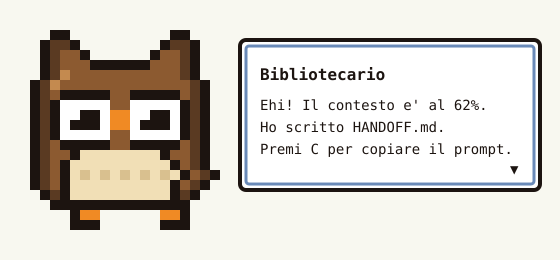

# context-guard

**Una mod per Claude Code che ti avvisa quando la chat si sta riempiendo e prepara da sola il passaggio alla chat successiva.**

> *In English:* a Claude Code plugin (function hooks) that watches the context window. At 45% it warns you; at 60% it asks the model to write a `HANDOFF.md` (what was done, what's next, a ready-to-paste prompt for a fresh chat) and to keep a short project "grimoire" up to date in `CLAUDE.md`. A pixel-art owl pops up, Pokémon-style, to tell you it's time to switch chats. Docs below are in Italian.

<p align="center"></p>

## Perché esiste

Nelle sessioni lunghe il contesto si riempie: le risposte peggiorano, la compattazione automatica perde dettagli e aprire una chat nuova significa rispiegare tutto. context-guard rende quel passaggio una cosa che succede da sola, prima che sia troppo tardi:

- ti dice **quando** è il momento di cambiare chat;
- scrive **cosa** la chat nuova deve sapere, nel progetto e non in chat;
- ti dà **il prompt** da incollare, a un tasto di distanza.

## Cosa fa

| Contesto | Azione |
| --- | --- |
| 45% | Avviso una tantum. Da qui in poi la status line mostra `ctx NN%`. |
| 60% | Il modello scrive l'handoff e aggiorna il grimorio, poi spunta il Bibliotecario. |
| 70%, 80%, 90% | Riscrive gli stessi file, così restano aggiornati. |
| `/ctx-handoff` | Fa tutto subito, a qualsiasi percentuale. |
| `/ctx-grimorio` | Riapre il grimorio in attesa di conferma, da applicare o scartare. |
| `/bibliotecario` | Apre la chat con il Bibliotecario. Con una domanda dopo il comando risponde subito. |

Dopo un `/compact` o un `/clear` le soglie ripartono da zero.

### I due file

**`HANDOFF.md`**, specifico della sessione: cosa è stato fatto, stato attuale, prossimi passi numerati e un blocco con il prompt per la chat nuova.

**Il grimorio in `CLAUDE.md`**, stabile nel tempo: ragion d'essere del progetto, architettura e regole da rispettare. Vive tra due marcatori e il resto del file non viene mai toccato:

```markdown
<!-- context-guard:start -->
## Grimorio del progetto (aggiornato da context-guard il 2026-10-09)
...
<!-- context-guard:end -->
```

### Il Bibliotecario

Quando i file sono scritti, un gufo in pixel art 20x20 scivola dentro da sinistra con un riquadro di dialogo in stile Pokémon. Il testo appare a macchina da scrivere, poi lampeggia il cursore ▼. Nell'app desktop è un `Svg`, sul terminale un `Raster` colorato a mezzi blocchi.

- `C` copia il prompt per la nuova chat negli appunti.
- `A` e `S` applicano o scartano il grimorio, quando è in attesa di conferma.
- `O` o Esc chiude il dialogo.

### Parlare con il Bibliotecario

Sopra il prompt c'è sempre il pulsante **🦉 Bibliotecario**. In alternativa scrivi `/bibliotecario`, oppure `/bibliotecario <domanda>` per chiedere subito. Si apre una chat in cui puoi chiedergli cosa è stato fatto nella sessione, cosa manca, quanto è pieno il contesto o quando conviene cambiare chat. Risponde conoscendo la conversazione, il grimorio e l'handoff del progetto. Accanto al pulsante compaiono due avvisi, quando servono: "grimorio in attesa" e "passaggio di chat in vista".

Nella chat ci sono tre azioni rapide:

- **Come siamo messi?** riassume contesto, ultimo handoff, grimorio in attesa e contenuti esterni, senza chiamare nessun modello.
- **Scrivi handoff** fa subito quello che farebbe al 60%.
- **Grimorio in attesa** riapre la conferma del grimorio.

Il Bibliotecario risponde e basta: non modifica file e non esegue azioni. Quelle restano ai pulsanti. L'app desktop non permette ai plugin di aggiungere pulsanti nella barra in alto, per questo il pulsante sta sopra il prompt.

## Le regole di sicurezza

La mod scrive file nei tuoi progetti, quindi è costruita per non rompere niente:

- **Handoff scritto da te:** se il file esiste e non l'ha scritto la mod, nessuna riga viene toccata. La mod aggiorna solo una sua sezione marcata sotto il titolo.
- **Handoff con un altro nome:** se trova `PASSAGGIO.md`, `consegne.md`, `NEXT_STEPS.md`, `handoff-*.md` o simili, aggiorna quello invece di crearne un altro.
- **Quale CLAUDE.md:** dentro un repo git risale al massimo fino alla root del repo. Fuori da un repo usa solo la cartella della sessione. Un CLAUDE.md "di cartella superiore", per esempio quello del Desktop, non viene mai toccato.
- **Controllo sul progetto:** prima di scrivere il grimorio la mod visita la cartella e verifica che i percorsi citati tra backtick esistano davvero. Se ne cita almeno 3 e meno del 60% esiste, il grimorio viene scartato e un avviso elenca i percorsi mancanti. Così il riassunto di un progetto non può finire nel CLAUDE.md di un altro.
- **Controllo all'avvio:** a ogni nuova sessione la mod verifica il grimorio già presente e avvisa se sembra di un altro progetto.
- **Niente doppioni:** il modello ha l'istruzione di non ricopiare ciò che è già in CLAUDE.md, AGENTS.md e nei file importati.
- **Niente scritture fuori dal progetto:** il nome del file di handoff deve essere un semplice `.md` nella cartella della sessione, e la mod non scrive mai attraverso un link simbolico.
- **Marcatori protetti:** dal testo del modello vengono tolti tutti i marcatori `context-guard`, così una risposta non può chiudere la sezione in anticipo e toccare il resto del file.

### Protezione dalle istruzioni iniettate

Il grimorio finisce in `CLAUDE.md`, e le sessioni future lo leggono come istruzioni. Se nella sessione è entrato testo scritto da altri, per esempio una pagina web con istruzioni nascoste, quel testo non deve poter diventare una regola del progetto.

**La garanzia: nessuna modifica al grimorio entra in CLAUDE.md senza il tuo ok.** Ogni grimorio cambiato aspetta la tua conferma: il Bibliotecario mostra le righe aggiunte e tolte, e tu premi `A` per applicarle o `S` per scartarle. Se il grimorio nuovo dice le stesse cose di quello attuale, la mod non chiede niente e non scrive niente, quindi la conferma compare solo quando qualcosa cambia davvero.

Prima di arrivare a te, ogni grimorio passa tre controlli. Bloccano subito ciò che è palesemente malevolo e ti dicono perché qualcosa è sospetto, così la tua conferma è informata. Con l'opzione `confermaGrimorio` impostata a `solo-se-serve` i controlli diventano l'unica difesa e la conferma scatta solo quando uno di loro lo richiede:

- **Fonti esterne, approvazione obbligatoria.** La mod registra ogni strumento usato nella sessione. Se la sessione ha letto contenuti da fuori, il grimorio non viene scritto ma resta in attesa: il Bibliotecario mostra le righe aggiunte e tolte, e tu premi `A` per applicarle o `S` per scartarle. Contano come fonti esterne ricerche e pagine web, browser e tutti i connettori MCP come mail, documenti e chat, i comandi shell che scaricano, come `curl`, `wget`, `gh api` e `git pull`, e la lettura di file fuori dal progetto o dentro cartelle di codice di terzi come `node_modules`, `vendor` e `Downloads`. Se chiudi il dialogo, `/ctx-grimorio` lo riapre.
- **Filtri sul testo, blocco.** Il grimorio viene scartato se chiede di ignorare istruzioni precedenti, di scaricare ed eseguire codice, di inviare token o password, o di disattivare protezioni e permessi. Lo stesso vale se contiene blocchi codificati, caratteri invisibili, HTML attivo, o indirizzi web ed email che il progetto non cita già in CLAUDE.md, README.md, AGENTS.md o package.json. Le regole che vietano qualcosa, come "non condividere mai il token", non vengono bloccate.
- **Controllo indipendente, approvazione.** Ogni grimorio che ha superato i filtri viene giudicato da un modello piccolo e separato, Haiku, che non vede la sessione, non ha strumenti e riceve il testo come dati da giudicare. Se lo trova sospetto, per esempio perché chiede di copiare file verso terzi o di saltare le conferme, il grimorio va in approvazione con il motivo. Coglie le iniezioni scritte in modo da superare i filtri. Si disattiva con l'opzione `aiCheck`.

Con l'impostazione predefinita `sempre` l'unico modo perché un testo malevolo entri in CLAUDE.md è che tu lo approvi: leggi le righe aggiunte prima di premere `A`. Con `solo-se-serve` resta possibile, ma molto difficile, che un testo superi insieme filtri e controllo indipendente.

## Installazione

Serve Claude Code con il supporto ai plugin di function hooks. La mod è sviluppata e testata con la versione 2.1.278.

```bash
claude plugin marketplace add Rikdum18/context-guard
```

```bash
claude plugin install context-guard@riccardo-mods
```

Le sessioni avviate da quel momento caricano la mod, sia nel terminale sia nell'app desktop. Per aggiornarla:

```bash
claude plugin update context-guard@riccardo-mods
```

## Configurazione

Da `/plugin configure context-guard@riccardo-mods` in una sessione, oppure in `settings.json` sotto `pluginConfigs["context-guard"].options`.

| Campo | Default | Significato |
| --- | --- | --- |
| `warnAt` | 45 | Percentuale dell'avviso |
| `writeAt` | 60 | Percentuale della prima scrittura |
| `repeatEvery` | 10 | Riscrive ogni N punti oltre `writeAt`, 0 per scrivere una volta sola |
| `handoffFile` | `HANDOFF.md` | Nome del file di handoff |
| `updateClaudeMd` | true | Aggiorna il grimorio in CLAUDE.md |
| `aiCheck` | true | Fa giudicare ogni nuovo grimorio dal controllo indipendente |
| `pulsanteBibliotecario` | true | Mostra il pulsante del Bibliotecario sopra il prompt |
| `confermaGrimorio` | `sempre` | `sempre`: ogni modifica al grimorio aspetta il tuo ok. `solo-se-serve`: solo dopo contenuti esterni o un giudizio sospetto |

## Come funziona

È un plugin di *function hooks*: un modulo TypeScript che il motore di Claude Code carica ed esegue in un ambiente isolato, senza DOM e senza Node. Tutto passa dall'interfaccia `$` del motore.

- **`tool.call`:** registra se la sessione usa strumenti che portano dentro contenuti esterni o legge file fuori dal progetto.
- **`turn.complete`:** a fine turno legge il riempimento del contesto con `$.session.usage()` e decide se avvisare o scrivere.
- **`$.model.fork`:** fa al modello una domanda sulla trascrizione della sessione stessa, così la richiesta riusa la cache dei prompt invece di rimandare tutto da capo.
- **`$.fs`:** scrive i file e visita la cartella per il controllo sul progetto.
- **`$.model.complete`:** chiede a Haiku il giudizio indipendente sul grimorio, senza sessione né strumenti.
- **`flow.ts`:** tutto il percorso di scrittura, dalla richiesta al modello fino ai file, riceve file, modello e stato dall'esterno. Gli hook gli passano il motore, i test un progetto finto in memoria.
- **`ui.render` sul componente `AbovePrompt`:** disegna il pulsante del Bibliotecario sopra il prompt.
- **`ui.render` sul componente `Pane`:** disegna il dialogo e la chat del Bibliotecario. Un timer da 50 ms fa avanzare l'animazione tramite `$.state`, che sopravvive anche al ricaricamento del modulo.
- **`session.compact` e `session.end`:** azzerano le soglie dopo una compattazione o un `/clear`.

```
context-guard/
├── .claude-plugin/plugin.json   manifest e opzioni configurabili
├── hooks/
│   ├── hooks.json               punta a register.tsx
│   ├── register.tsx             gli hook e il dialogo
│   ├── flow.ts                  percorso di scrittura, testabile senza il motore
│   ├── logic.ts                 logica pura: soglie, prompt, merge dei file, controlli
│   ├── sprite.ts                il gufo e i suoi renderer SVG e Raster
│   └── *.test.ts                71 test, compreso il flusso completo
└── types/index.d.ts             contratto dello stato in $.state
```

La radice del repository è anche il marketplace (`.claude-plugin/marketplace.json`), per questo l'installazione è un solo comando.

## Sviluppo

```bash
claude plugin validate ./context-guard
```

```bash
claude plugin test ./context-guard
```

Per provare le modifiche senza installarle:

```bash
claude --plugin-dir ./context-guard
```

## Limiti noti

- Il riempimento viene letto a fine turno: un turno lunghissimo che passa dal 40% al 75% riceve avviso e scrittura insieme.
- Ogni scrittura costa una lettura in cache della trascrizione più qualche migliaio di token generati, e una chiamata breve a Haiku per il controllo indipendente.
- Un aggiornamento della mod vale solo per le sessioni avviate dopo: quelle già aperte continuano con la versione vecchia.
- Il controllo sul progetto si basa sui percorsi citati: un grimorio che ne cita meno di 3 non viene giudicato.
- L'API dei function hooks è in accesso anticipato e può cambiare tra le versioni di Claude Code.

## Licenza

[MIT](LICENSE)
